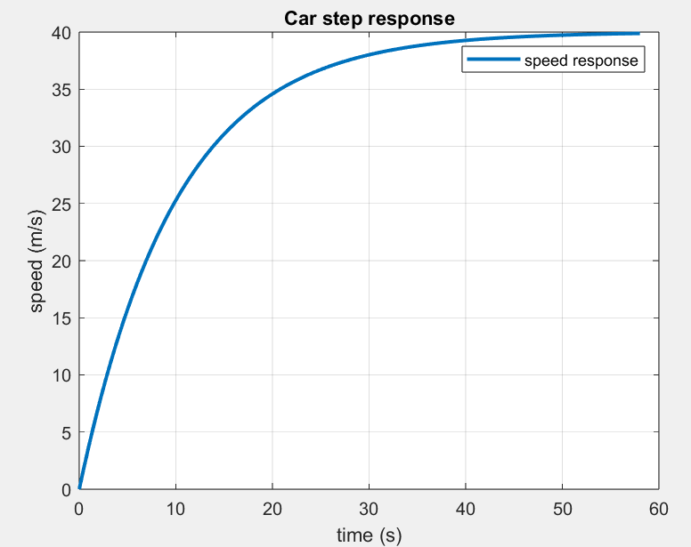

# MAE 143B 4th Hour Problem Sessions
Repository for Matlab coding problems


## Examples

<details open>
<summary>Step response for a "car"</summary>
<br>

### Part a)
We are going to model a car as a simple first-order system with transfer function

$`
    G(s)
    =
    \frac{0.04}{s+0.1}
`$

Use the Matlab `tf` command to create a car: 
```
car = tf(0.04, [1 .1])
```
Next, use the `step` command to simulate the step response of the car model: 
```
[y,t] = step(car);
```
Make sure to follow the command with a semicolon to suppress writing a long output vector.
Now we can plot the step response corresponding to a 100mm depression of the gas pedal: 
```
plot(t,y*100,'LineWidth',2)
title('Car step response')
xlabel('time (s)')
ylabel('speed (m/s)')
legend('speed response')
grid on
```
Here is what I get 



### Part b) P-control
Create a proportional controller transfer function with, say, $K_P=10$:
```
Kp=10; pcontrol = tf(Kp,1);
```
Put this into a unity feedback loop (with the negative sign as appropriate for error feedback): 
```
pcloop = feedback(pcontrol*car,1);
```
This is the closed-loop transfer function from reference speed $r_t$ to output $y_t$.
We can also compute the closed-loop transfer function from reference speed $r_t$ to accelerator position in mm:
```
uloop = feedback(pcontrol, car);
```
Now we can use `step` to plot the response of the car for different values of $K_P$. 
We expect that all of the responses are exponentials. 


### Part c) PI-Control 

</details>