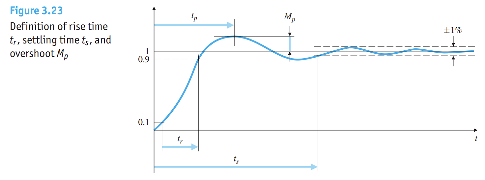
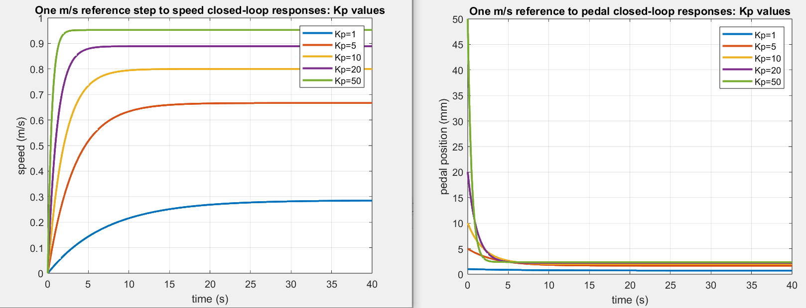

# MAE 143B 4th Hour Problem Sessions
Repository for Matlab coding problems

Helpful tip: you can always type `help (command)` to get information on a command or function

## Examples

<details closed>
<summary>Session 3, Problem 1: Position Servo Device Control</summary>
<br>

For a complete script, check out Session3/problem1.m. To reproduce the plots here, you may need to modify the script to simulate and plot several system responses for different gain values.

Consider the following plant transfer function

$`
    G_\theta(s) 
    =
    \frac{\Theta(s)}{V(s)}
    =
    \frac{c}{Js^2+bs}.
`$

where $J=1$, $b=0.104$, and $c=0.2$. 
This second-order transfer function maps voltage input to angular position output, and it serves as a simplified model of a DC motor.

Suppose we want to use this motor as a servo to control a throttle valve. 
We would like to specify a desired angular position $\theta_r(t)$ of the valve:
closed corresponds to 0, and open corresponds to 1. 
We add a sensor that measures the angular position of the motor $\theta_m(t)$, and as a first attempt at the control design, we will devise a simple proportional controller: 

$`
    v(t)
    =
    K(\theta_r - \theta_m).
`$

### Part a) 
What is the closed-loop transfer function of the system, i.e. the mapping from $\theta_r(t)$ to $\theta_m(t)$?
Start by drawing a block diagram for the system.

This is a unity feedback system with P-control, P-gain is $K$ and the reference is $\theta_r$. So, the transfer function from $\theta_r$ to $\theta_m$ is

$`
                      \frac{KG_\theta(s)}{1+KG_\theta(s)}  =\frac{0.2\,K}{s^2+0.104\,s+0.2K}.
`$

How can we verify this with Matlab? 
Well, for a particular value of $K$, we can construct the closed-loop transfer function of the system using the `feedback()` command: 
```
c = 0.2; J = 1; b = 0.104;
G_theta = tf(c,[J b 0]); 
Gcloop = feedback(1*G_theta,1) % closed-loop tf for K=1
```
```
> G =
           0.2
  -------------------
  s^2 + 0.104 s + 0.2
```


Notice how there is an envelope and they all decay at similar rates? 


While the damping envelope is the same for all of them, they have very different behaviors; we choose to characterize the behavior of second-order systems by defining the concepts of rise-time, overshoot, etc.

These lead to the following approximate formulas that we can use to design controllers to meet our specifications: 


For a closed-loop system, the gain parameters of our controllers will generally appear in some relationship to the parameters $\zeta$, $\omega_n$, etc.

### Part b) 
Let's plot the closed-loop step response for various values of $K$: 


</details>

<details closed>
<summary>Session 2, Problem 1: Step response for a "car"</summary>
<br>

For a complete script, check out Session2/problem1.m. To reproduce the plots here, you may need to modify the script to simulate and plot several system responses for different gain values.

### Part a)
We are going to model a car as a simple first-order system with transfer function

$`
    G(s)
    =
    \frac{0.04}{s+0.1}
`$

The input $u(t)$ to the car is the gas pedal position, in millimeters (mm), and the output $y(t)$ is the speed of the car.

Use the Matlab `tf` command to create a car: 
```
car = tf(0.04, [1 .1])
```
Next, use the `step` command to simulate the step response of the car model: 
```
[y,t] = step(car);
```
Make sure to follow the command with a semicolon to suppress writing a long output vector.
Now we can plot the step response corresponding to a 100mm depression of the gas pedal: 
```
plot(t,y*100,'LineWidth',2)
title('Car step response')
xlabel('time (s)')
ylabel('speed (m/s)')
legend('speed response')
grid on
```
Here is what I get 


### Part b) P-control
Create a proportional controller transfer function with, say, $K_P=10$:
```
Kp=10; pcontrol = tf(Kp,1);
```
Put this into a unity feedback loop (with the negative sign as appropriate for error feedback): 
```
pcloop = feedback(pcontrol*car,1);
```
This is the closed-loop transfer function from reference speed $r(t)$ to output $y(t)$.
We can also compute the closed-loop transfer function from reference speed $r(t)$ to gas pedal position in mm:
```
uloop = feedback(pcontrol, car);
```
Now we can use `step` to simulate and then plot the response of the car for different values of $K_P$. 
We expect that all of the responses are exponentials.
Here is what I get for various different gains: 



Remember that this is a feedback control problem where we are trying to track the reference $r(t) = 1$ m/s. 
How well does p-control work for this problem?

*The proportional controller fails to get the car speed to match the one m/s input that we applied to the reference $r(t)$. As we increase the gain, we get closer, but we never quite get there. On the right, we see that as expected, as we increase the gain, we step harder and harder on the gas, but still we end up having a steady-state error due to not reaching the desired speed. Proportional control is not the right choice of controller for this system.*

### Part c) PI-Control 
Create a PI-controller with, say, $K_P=10$ and $K_I=5$:
```
Kp=10; Ki=5; picontrol = tf([Kp Ki],[1 0])
```
Create the PI unity feedback closed loop:
```
picloop = feedback(picontrol*car,1);
```
Create the control transfer function:
```
cpiloop = feedback(picontrol, car)
```
Try out the Matlab logical function `isstable`
```
isstable(picloop)
```

Now we can again use `step` to simulate and then plot the response of the car for different values of $K_P$ and $K_I$. 
Note that now we have two poles in the closed-loop transfer functions. 

Here is what I get for various gain parameters: 


Again, remember that the `step` function is simulating the response to a unit step reference input, so we are trying to track a reference of $r(t) =  1$ m/s. 
Comparing the PI controller performance with the P controller performance, do you notice any differences?

*The proportional-integral controllers all reach the desired steady-state value of 1, corresponding to the reference $r(t) =  1$ m/s. Now we can choose different gain values to get different behaviors, i.e. we can specify that we don't just want to reach 1 m/s, we also don't want to overshoot (to avoid a speeding ticket), we don't want to oscillate (to avoid motion sickness), etc.*

</details>