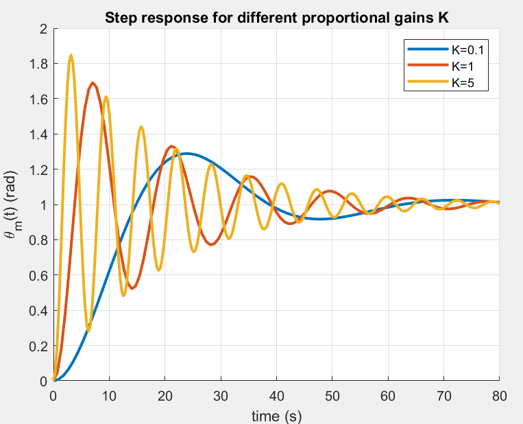

# MAE 143B 4th Hour Problem Sessions
Repository for Matlab coding problems

Helpful tip: you can always type `help (command)` to get information on a command or function


## Examples

<!-- <details closed>
<summary>Session 3, Problem 1: Servo position control</summary>
<br> -->

## Session 3, Problem 1: Servo position control
For a complete script, check out Session3/problem1.m. To reproduce the plots here, you may need to modify the script to simulate and plot several system responses for different gain values.

Consider the following plant transfer function

$`
    G_\theta(s) 
    =
    \frac{\Theta(s)}{V(s)}
    =
    \frac{c}{Js^2+bs}.
`$

where $J=1$, $b=0.104$, and $c=0.2$. 
This second-order transfer function maps voltage input to angular position output, and it serves as a simplified model of a DC motor.

Suppose we want to use this motor as a servo to control a throttle valve. 
We would like to specify a desired angular position $\theta_r(t)$ of the valve:
closed corresponds to 0, and open corresponds to 1. 
We add a sensor that measures the angular position of the motor $\theta_m(t)$, and proceed with controller design.

### Part a) Proportional Control
As a first attempt at the control design, we will devise a simple proportional controller: 

$`
    v(t)
    =
    K(\theta_r - \theta_m).
`$

What is the closed-loop transfer function of the system, i.e. the mapping from $\theta_r(t)$ to $\theta_m(t)$?
Start by drawing a block diagram for the system.

---

This is a unity feedback system with P-control, P-gain is $K$ and the reference is $\theta_r$. So, the transfer function from $\theta_r$ to $\theta_m$ is

$`
H(s) =                      \frac{KG_\theta(s)}{1+KG_\theta(s)}  =\frac{0.2\,K}{s^2+0.104\,s+0.2K}.
`$

**Can we verify this with Matlab?**
Well, for a particular value of $K$, we can construct the closed-loop transfer function of the system using the `feedback()` command: 
```
c = 0.2; J = 1; b = 0.104;
G_theta = tf(c,[J b 0]); 

% simple check of our tf derivation
feedback(1*G_theta,1) % closed-loop tf for K=1
```
```
> ans =
           0.2
  -------------------
  s^2 + 0.104 s + 0.2
```

Is it stable? 

$`
p_{1,2} = -\frac{0.104}{2} \pm \frac{\sqrt{0.104^2-0.8K}}{2}
`$
(Yes, for $K > 0$)

---
Here are plots of the step response of the closed-loop system with different gains:

```
%% Part (a): Proportional Control
% Plot the step response for different gains
figure; hold on; grid on; 

for K = [.1 1 5]
    G_p = tf(K,1);
    H = feedback(G_p*G_theta,1); % closed-loop tf for our K
    [y,t] = step(H);
    plot(t,y,'LineWidth',2); 
end

title('Step response for different proportional gains K_p')
xlabel('time (s)'); ylabel('\theta_m(t) (rad)')
legend('K=0.1','K=1','K=5')
```


Notice how there is an envelope and they all decay at similar rates? 
What do we think is happening to the poles of the system as we change the proportional gain $K$? *(Think about what* $\sigma$ *indicates in the poles:* $p_{1,2} = -\sigma \pm j \omega_d$ *.)*
(Section 3.3 in Franklin & Powell)


While the damping envelope is the same for all of them, they have very different behaviors; we choose to characterize the behavior of second-order systems by defining the concepts of rise-time, overshoot, etc.

These lead to the following approximate formulas that we can use to design controllers to meet our specifications: 

$`
    t_r \simeq \frac{1.8}{\omega_n} \qquad\qquad\qquad \text{(rise-time formula)}
`$

$`
    M_p = e^{-\pi \zeta / \sqrt{1-\zeta^2}} \qquad \text{(overshoot formula)}
`$

$`
    t_s = \frac{4.6}{\zeta \omega_n} \qquad\qquad\qquad\! \text{(settling-time formula)}
`$


> [!CAUTION]  
> These formulas are derived from a _second-order system_ with _no zeros_. In reality no real system is ever a pure second-order system with no zeros, so these should always be used an approximation/starting point. 


How do we use those formulas? 
For a closed-loop system, the gain parameters $K$ of our controllers will generally appear in some relationship to the parameters $\zeta$, $\omega_n$, etc.

### Part b) I, D, PD, PI, PID, or ID control?
We go and show the controller responses in the previous figure to our coworkers who are in charge of designing the throttle valve. 
They aren't very happy with the response, and they say they would like it to 

1. go from 0 to 1 quickly, 
2. do so without overshooting so much, and 
3. do so without so many oscillations. 

*(Hence why we care about these somewhat arbitrary rise-time, overshoot, and settling time specifications. They give us a way to describe our desired performance characteristics. )*

We saw that with just one gain parameter from a P-controller, we can only achieve one performance specification: as we improve the rise-time, we get worse overshoot, and as we improve the overshoot, we get worse rise-time.
We conclude that in order to achieve fast rise-time and low overshoot, a different control scheme is necessary. 
The options we know are: 

1. P control
2. I control
3. D control
4. PI control
5. PD control
6. ID control
7. PID control

How do we choose which one to apply?

* We could implement each controller and simulate the response, but this depends on our choice of gain parameters, so if we don't get good performance is it because of the controller form or because we chose bad gains...
* We can alternatively look at the closed-loop transfer functions and apply the concepts we have learned: 
    * Stability has to do with the poles, i.e. roots of the denominator 
    * Rise-time, overshoot, etc. are second-order concepts, and for other types of systems they are only approximations

Let's again look at the closed-loop transfer functions for a few of the options: 

$`
    \text{P:} \,\,\,\quad  H(s) = \frac{K_p c}{Js^2 + bs + K_pc}
`$

$` 
    \text{I:} \qquad  H(s) = \frac{K_i c}{Js^3 + bs^2 + K_ic}
`$

$`
    \text{D:} \,\,\,\quad  H(s) = \frac{K_d c s}{Js^2 + (b + K_dc)s}
`$

$`
    \text{PI:} \,\,\quad H(s) =  \frac{K_p c s + K_i c}{Js^3 + bs^2 + K_pcs+K_ic}
`$

$`
    \text{PD:} \quad H(s) =  \frac{K_d c s + K_p c}{Js^2 + (b + K_dc)s + K_pc} 
`$

> [!TIP]  
> Important lesson #1: as engineers, we should be interested in solving the problems that we know how to solve

## Part c) PD Control
With that in mind, we are going to choose PD control: 
* I know how to compute roots of a quadratic polynomial, so I can verify if it is stable. *(That is hard for a cubic polynomial, and [there is no general formula for roots of polynomials of degree > 4](https://www.wolframalpha.com/input?i=abel%E2%80%99s+impossibility+theorem). Later on we will probably learn about the Routh-Hurwitz criterion that allows us to check stability without explicitly computing the roots.)*
* PD control results in a second-order system with one zero. We can apply the time domain specifications relating to rise-time, overshoot, etc. more readily 

So our controller is $G_{PD}(s) = K_d s + K_p$, and the closed loop transfer function is

$`
    H(s) =  \frac{K_d c s + K_p c}{Js^2 + (b + K_dc)s + K_pc}  = \frac{0.2K_d s + 0.2K_p}{s^2 + (0.104 + 0.2K_d)s + 0.2K_p} 
`$

First question: is it stable? 

$`
p_{1,2} = -\frac{0.104+0.2K_d}{2} \pm \frac{1}{2}\sqrt{(0.104+0.2K_d)^2-0.8K_p} 
`$
(Yes, assuming $K_d > 0$ and $K_p > 0$)

It is possible to do the control design without resorting to plotting the responses (although it is always good to plot and verify our results).
To get a starting point, we can use the following formulas:

$`
    t_r \simeq \frac{1.8}{\omega_n} \qquad\qquad\qquad \text{(rise-time formula)}
`$

$`
    M_p = e^{-\pi \zeta / \sqrt{1-\zeta^2}} \qquad \text{(overshoot formula)}
`$

$`
    t_s = \frac{4.6}{\zeta \omega_n} \qquad\qquad\qquad\! \text{(settling-time formula)}
`$

Let's say we want a rise-time of less than 5 seconds. 
We can rearrange the first formula and find (with $\omega_n = \sqrt{0.2 K_p}$ for this closed-loop system)

$`
    t_r \simeq \frac{1.8}{\omega_n} \qquad\qquad\qquad \text{(rise-time formula)}
`$

$`
    \omega_n \simeq \frac{1.8}{t_r}
`$

$`
    0.2 K_p \simeq \frac{1.8^2}{5^2}
`$

$`
    K_p \simeq \frac{1.8^2}{5} \approx 0.648
`$

So if $K_p > 0.648$, the rise time should be less than 5 seconds. Let's choose $K_p = 1$. 

Let's say we want overshoot of less than 20%. 
For this closed-loop system $2\zeta\omega_n = 0.104 + 0.2K_d$, which we can rearrange to find $\zeta = \frac{0.052}{\sqrt{0.2}} + \frac{0.1}{\sqrt{0.2}}K_d$.
We can use the second formula to find the minimum gain $K_d$ required to bring the overshoot down below 20%.

$`
    M_p = e^{-\pi \zeta / \sqrt{1-\zeta^2}} \qquad \text{(overshoot formula)}
`$

$`
    % \text{ln}(M_p) = -\pi \zeta / \sqrt{1-\zeta^2} \\ 
    % \text{ln}(M_p)\sqrt{1-\zeta^2} = -\pi \zeta   \\ 
    % \text{ln}(M_p)^2(1-\zeta^2) - \pi^2 \zeta^2 = 0   \\ 
    % \zeta^2 (\text{ln}(M_p)^2 + \pi^2) = \text{ln}(M_p)^2  \\ 
    \zeta = -\frac{\text{ln}(M_p)}{\sqrt{\text{ln}(M_p)^2+\pi^2}}   \qquad \text{(overshoot formula rearranged)}
`$

$`
    \zeta = -\frac{\text{ln}(0.2)}{\sqrt{\text{ln}(0.2)^2+\pi^2}} \approx 0.4559
`$

Now we solve $\zeta = \frac{0.052}{\sqrt{0.2}} + \frac{0.1}{\sqrt{0.2}}K_d$ for $K_d$ and find that as long as $K_d > 1.5191$, we should have an overshoot of less than 20% for $K_p = 1$.

Let's look at the closed-loop step response for $K_p = 1$ and different values of $K_d$, the new derivative gain we have introduced and see if things check out.
```
%% Part (c): Proportional-Derivative Control
% Plot the step response for different gains
figure; hold on; grid on; t = 0:.01:80;
Kp = 1;
for Kd = [.1 1 1.5192 5]
    G_pd = tf([Kd Kp],1);
    H = feedback(G_pd*G_theta,1); % closed-loop tf for our K
    y = step(H,t);
    plot(t,y,'LineWidth',2); 
end

title('Step response for K_p=1 and different derivative gains K_d')
xlabel('time (s)'); ylabel('\theta_m(t) (rad)')
legend('K_d=0.1','K_d=1','K_d=5')
```
Here are the plots I get:


Does our overshoot calculation match the plot? Why or why not?

> [!TIP]  
> Important lesson #2: *good enough* is an important phrase to an engineer. Even if we work in optimal control, we are not actually interested in "the best" control; [we just want something that satisfies our requirements, typically with the minimum effort on our part.](https://www.merriam-webster.com/dictionary/satisfice) 


In this exercise we used the time specification formulas to reach approximate values for the proportional and derivative gains.
We then resorted to plotting the response to verify if we met the performance requirements and then update our control gains.


<!-- </details> -->

<details closed>
<summary>Session 2, Problem 1: Step response for a "car"</summary>
<br>

For a complete script, check out Session2/problem1.m. To reproduce the plots here, you may need to modify the script to simulate and plot several system responses for different gain values.

### Part a)
We are going to model a car as a simple first-order system with transfer function

$`
    G(s)
    =
    \frac{0.04}{s+0.1}
`$

The input $u(t)$ to the car is the gas pedal position, in millimeters (mm), and the output $y(t)$ is the speed of the car.

Use the Matlab `tf` command to create a car: 
```
car = tf(0.04, [1 .1])
```
Next, use the `step` command to simulate the step response of the car model: 
```
[y,t] = step(car);
```
Make sure to follow the command with a semicolon to suppress writing a long output vector.
Now we can plot the step response corresponding to a 100mm depression of the gas pedal: 
```
plot(t,y*100,'LineWidth',2)
title('Car step response')
xlabel('time (s)')
ylabel('speed (m/s)')
legend('speed response')
grid on
```
Here is what I get 


### Part b) Integral control
Create a proportional controller transfer function with, say, $K_P=10$:
```
Ki=10; icontrol = tf(Kp,[1 0]);
```
Put this into a unity feedback loop (with the negative sign as appropriate for error feedback): 
```
icloop = feedback(icontrol*car,1);
```
This is the closed-loop transfer function from reference speed $r(t)$ to output $y(t)$.
We can also compute the closed-loop transfer function from reference speed $r(t)$ to gas pedal position in mm:
```
uloop = feedback(pcontrol, car);
```
Now we can use `step` to simulate and then plot the response of the car for different values of $K_P$. 
We expect that all of the responses are exponentials.
Here is what I get for various different gains: 


Remember that this is a feedback control problem where we are trying to track the reference $r(t) = 1$ m/s. 
How well does p-control work for this problem?

*The proportional controller fails to get the car speed to match the one m/s input that we applied to the reference $r(t)$. As we increase the gain, we get closer, but we never quite get there. On the right, we see that as expected, as we increase the gain, we step harder and harder on the gas, but still we end up having a steady-state error due to not reaching the desired speed. Proportional control is not the right choice of controller for this system.*

### Part c) PI-Control 
Create a PI-controller with, say, $K_P=10$ and $K_I=5$:
```
Kp=10; Ki=5; picontrol = tf([Kp Ki],[1 0])
```
Create the PI unity feedback closed loop:
```
picloop = feedback(picontrol*car,1);
```
Create the control transfer function:
```
cpiloop = feedback(picontrol, car)
```
Try out the Matlab logical function `isstable`
```
isstable(picloop)
```

Now we can again use `step` to simulate and then plot the response of the car for different values of $K_P$ and $K_I$. 
Note that now we have two poles in the closed-loop transfer functions. 

Here is what I get for various gain parameters: 


Again, remember that the `step` function is simulating the response to a unit step reference input, so we are trying to track a reference of $r(t) =  1$ m/s. 
Comparing the PI controller performance with the P controller performance, do you notice any differences?

*The proportional-integral controllers all reach the desired steady-state value of 1, corresponding to the reference $r(t) =  1$ m/s. Now we can choose different gain values to get different behaviors, i.e. we can specify that we don't just want to reach 1 m/s, we also don't want to overshoot (to avoid a speeding ticket), we don't want to oscillate (to avoid motion sickness), etc.*

</details>